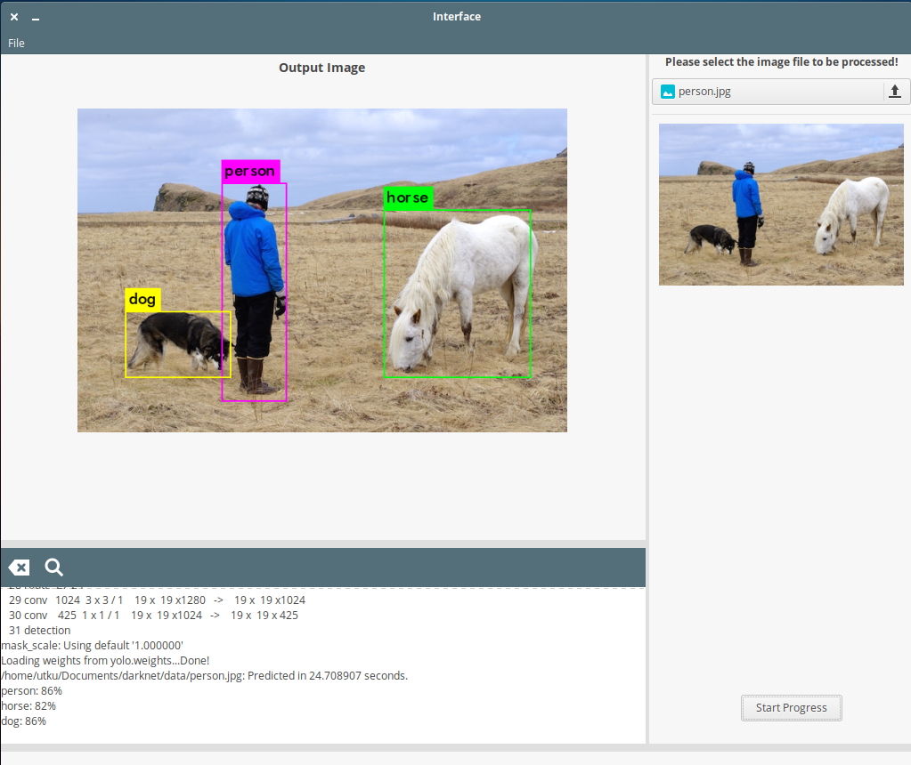

# Basic Gtk interface for Darknet

This interface designed for https://github.com/pjreddie/darknet.

## Usage

git clone https://github.com/utkudarilmaz/DarkNet-Interface

cd DarkNet-Interface/

git clone https://github.com/pjreddie/darknet

cd darknet

make

wget https://pjreddie.com/media/files/yolov3.weights

cd ../src/

python3 interface.py

## Screenshots

